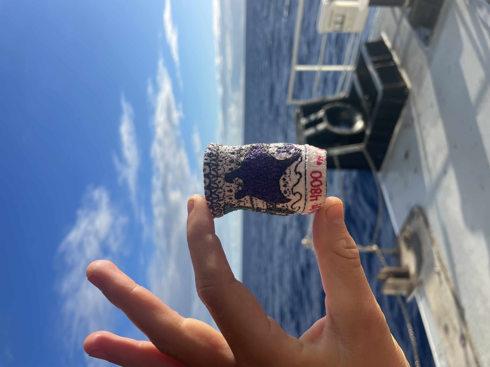
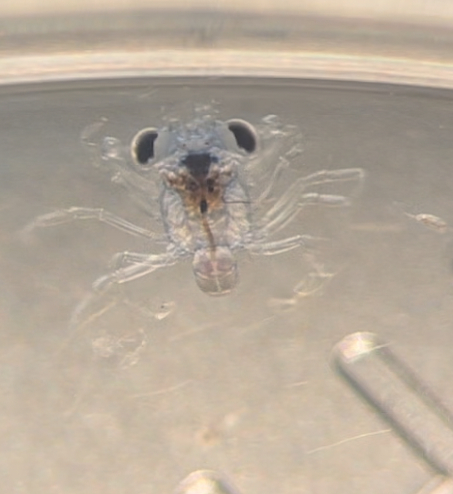
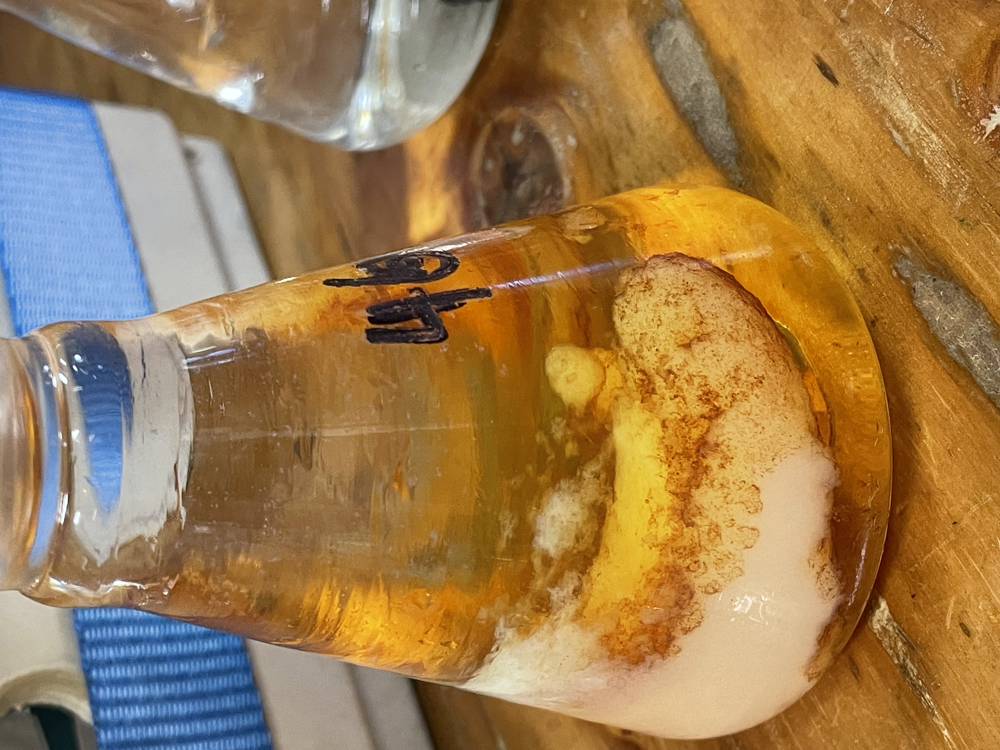
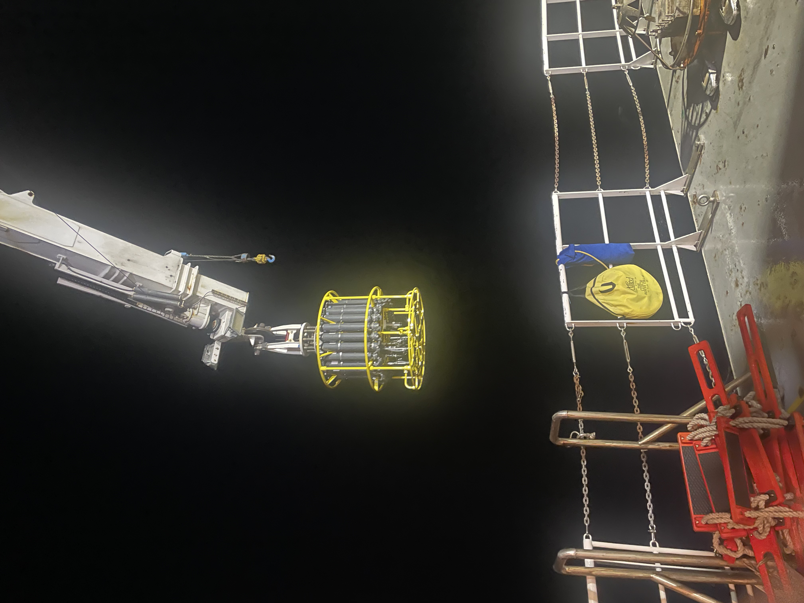
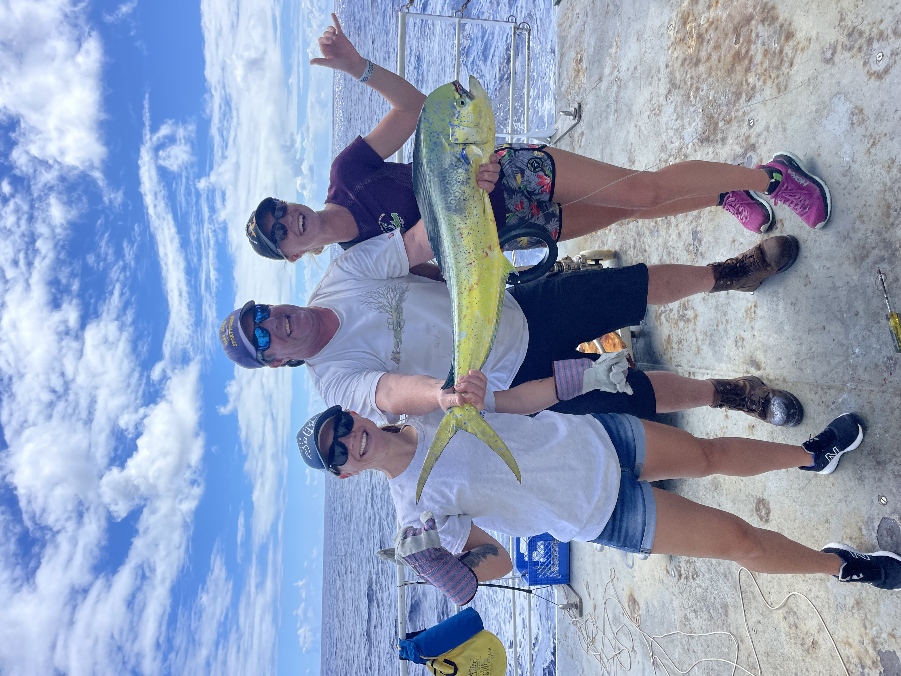

I had an incredible week on the Hawaii Ocean Time Series (HOT) cruise aboard the UH Kilo Moana!

I had the privilege of volunteering and contributing to valuable oceanographic research. My time on the cruise involved:

Ocean Sampling: Assisting in CTD deployments to measure nutrient, salinity, and oxygen levels.
- <b>Plankton Research</b>: Conducting plankton net tows and filtering chlorophyll samples.
- <b>Laboratory Work</b>: Performing titrations using a Winkler oxygen titrator.
- <b>Meteorological Observation</b>s: Gathering essential weather data.
  
I am extremely grateful for the opportunity to learn from experienced researchers and contribute to long-term ocean monitoring.

  

    

      
    

    

      
    

    

      
    

    

      
    

    

      
    

    

      
    

  

