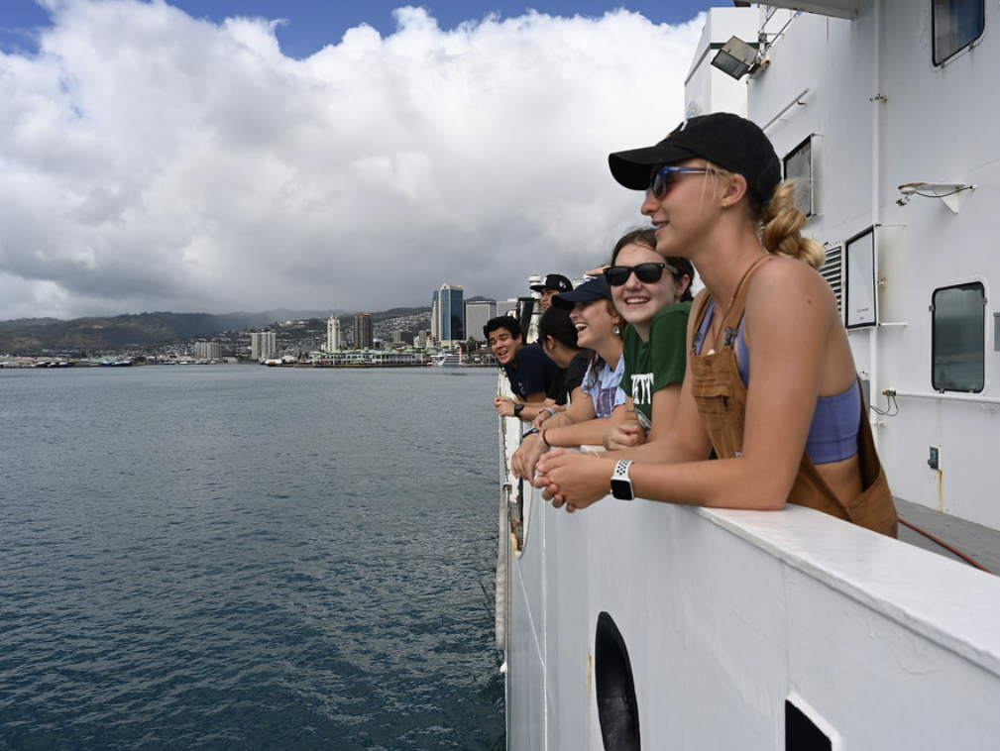
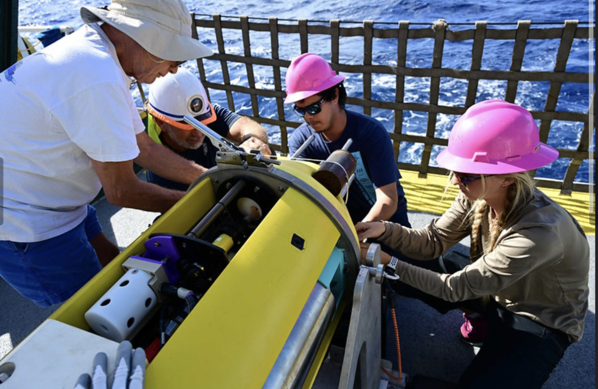
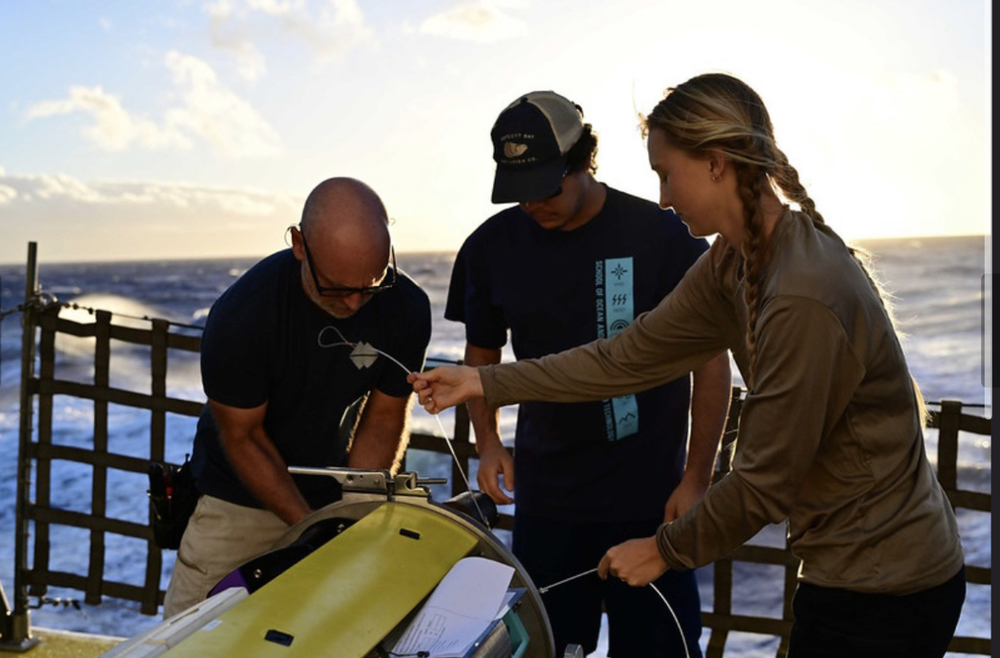

Thrilled to share my experiences from three research cruises with Dr. Carter aboard the UH Kilo Moana!

As part of the team, I’ve had the opportunity to:

-<b>Lead and Mentor<b>: Headed night shift operations, guiding a team of undergraduate researchers.

-<b>Technical Expertise<b>: Deployed and operated CTD instruments to collect crucial oceanographic data.

-<b>Hands-on Research<b>: Assisted in launching and recovering the Hadal water column profiler, and participated in plankton net tows and laboratory analyses.

Check out this Voice of the Sea episode, where I got the incredible opportunity to discuss the new hadal profiler and the sea going research we've been helping out with, along with other researchers and graduate students involved in this project. I am deeply greatful to have the opportunity to work on such an inspiring, innovative project.

Voice of the Sea episode on the Hadal Water Column Profiler : <a href="https://www.youtube.com/watch?v=e50HsKAsWtI">here</a>

  

    

      
    

    

      
    

    

      
    

  

