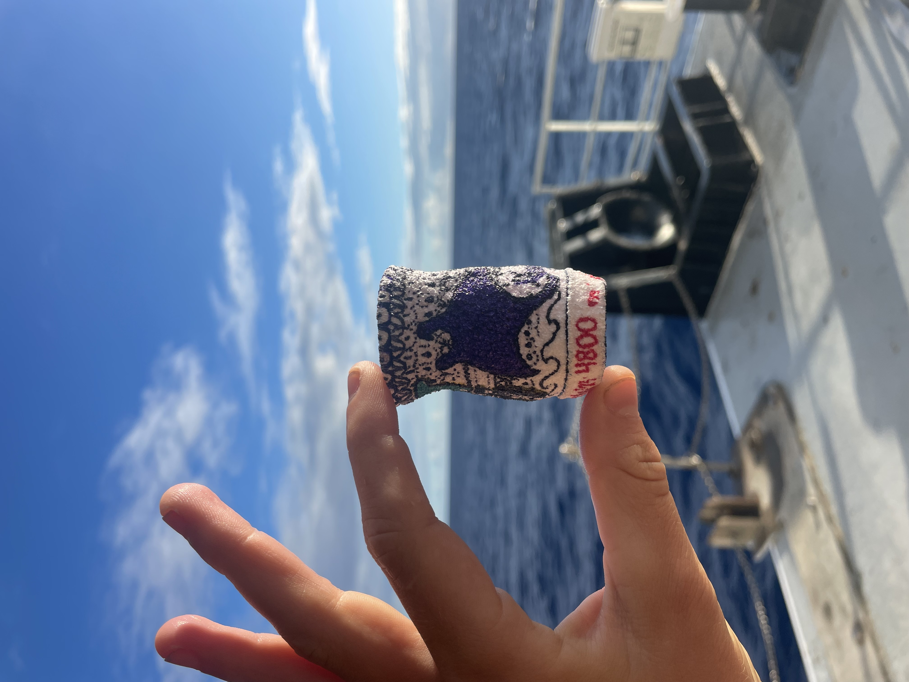
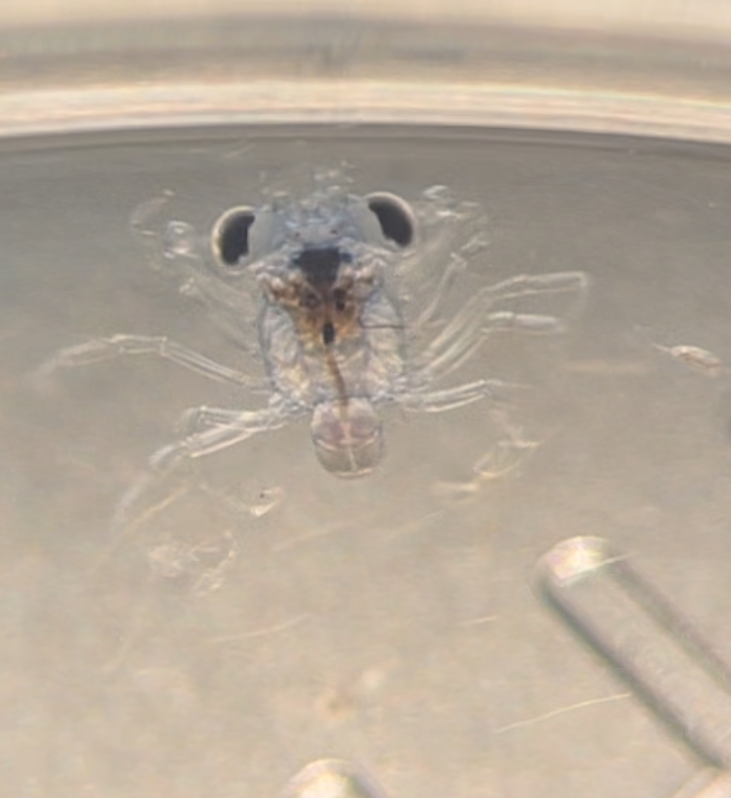
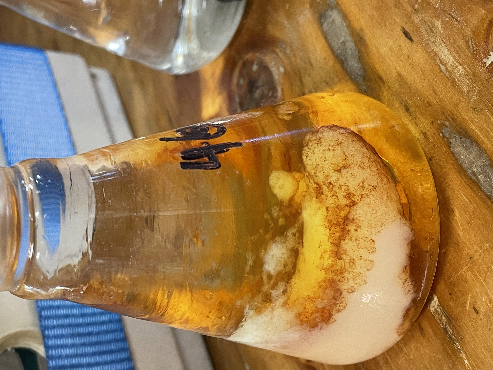
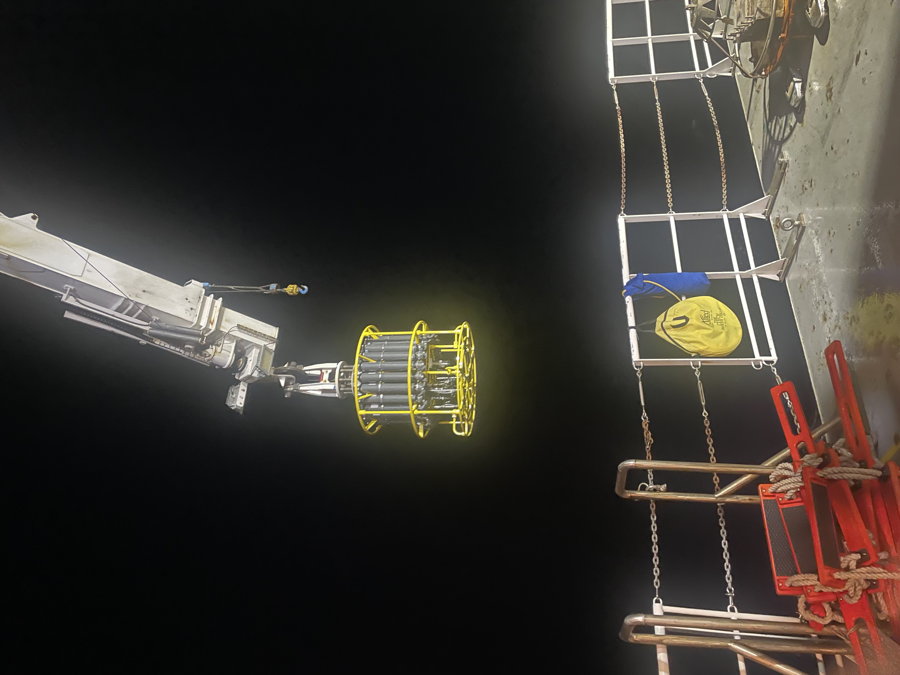
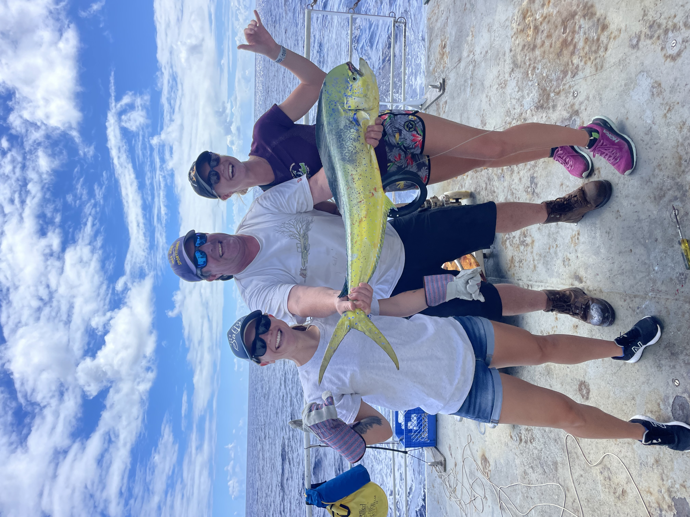
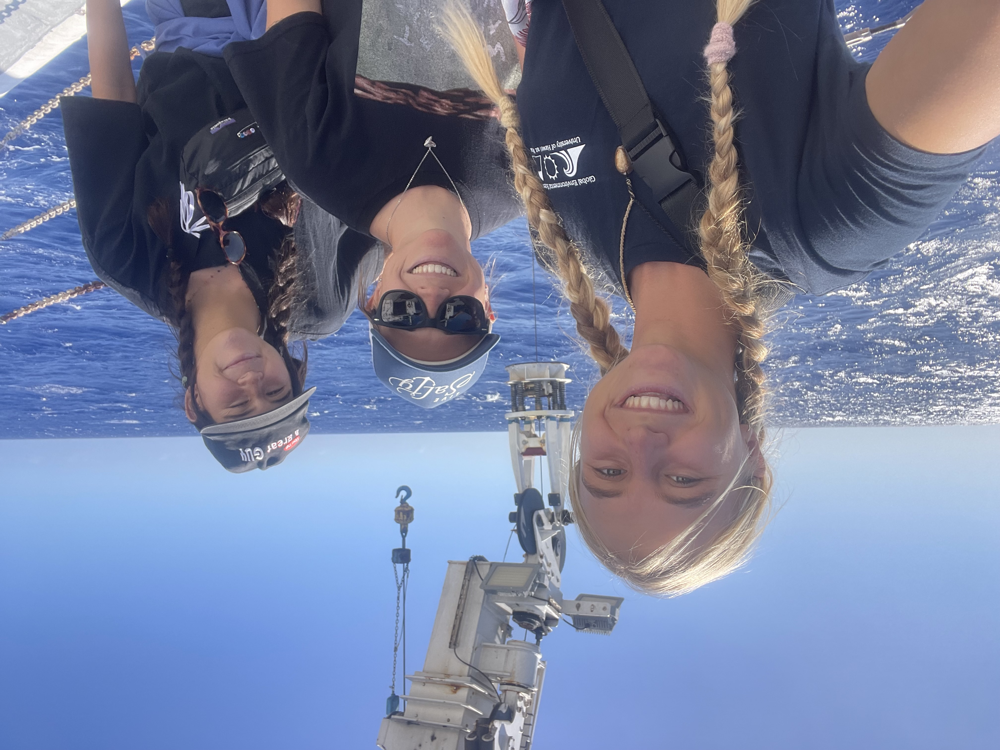

I am deeply grateful for the incredible opportunity to present a lightning talk at the Reef Futures International Conference on Coral Reef Restoration in Cancun, Mexico.
This experience has been truly enriching, allowing me to learn about groundbreaking technologies and strategies that are equipping conservationists worldwide to advance reef restoration efforts. It was inspiring to witness the diverse approaches being implemented across the globe, especially the innovative strategies developed by those working with limited resources.
Sharing my research and restoration recommendations with professionals at the forefront of designing and executing restoration projects has been an incredibly humbling experience. I feel honored to have had this platform and am immensely thankful to everyone who has supported me on this journey, particularly the ToBo Lab team and my advisor, Rob Toonen, for helping me get here. 
Mahalo Nui Loa!

  

    

      
    

    

      
    

    

      
    

    

      
    

    

      
    

    

      
    

  

