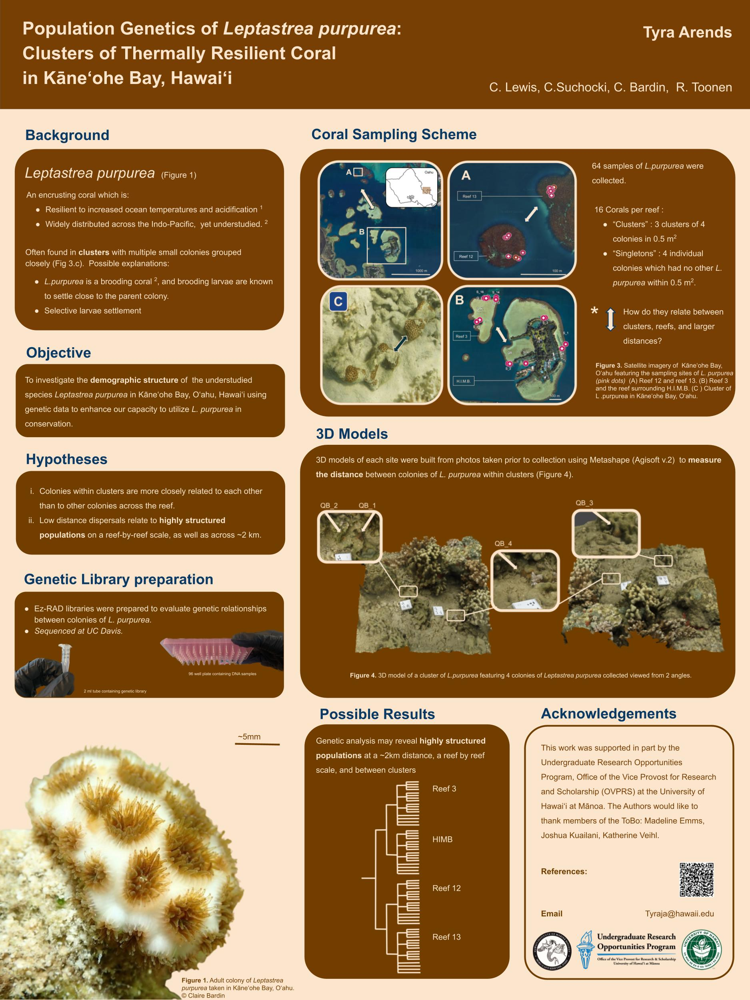

I had the oppertunitty to present my poster my poster titled "Understanding the Population Genetics of Leptastrea Purpurea, a Thermally Resillient Coral In Kaneohe Bay" at the 2024 Hawaii Concervation Conference 2024. It was a great experience, attending inspiring talks and meeting Hawaiis brilliant conservation feild. 

